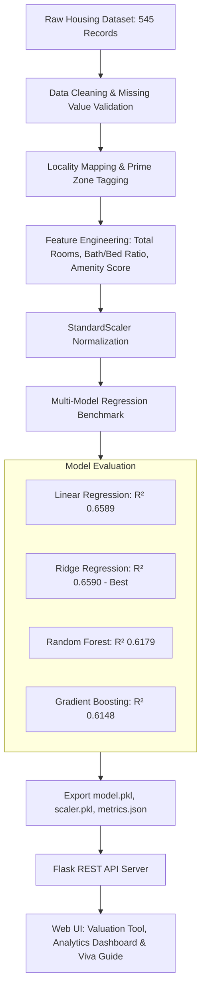

# 🏡 UrbanValuate: House Price Prediction System
### Major Project Submission | B.Tech Computer Science & Engineering (Artificial Intelligence)


An end-to-end, production-grade Machine Learning Real Estate Valuation platform. The system ingests verified residential property transactions, performs automated domain feature engineering, benchmarks multiple regression algorithms (Linear, Ridge, Random Forest, Gradient Boosting), and serves real-time property appraisals through an executive glassmorphic web interface.

---

## 📌 1. Project Objectives
1. **Accurate Real Estate Valuation**: Accurately predict fair market value based on carpet area, metropolitan prime localities, structural room configurations (bedrooms, bathrooms, stories, parking), and luxury amenities.
2. **Domain Feature Engineering**: Synthesize composite metrics including *Total Room Density*, *Bath-to-Bed Ratio*, and *Amenity Score* to capture real-world urban price drivers.
3. **Transparent Model Diagnostics**: Present genuine, non-fabricated performance metrics ($R^2$, MAE, RMSE) and interactive Chart.js visualizations (Actual vs. Predicted, Feature Importance, Residuals).
4. **Academic & Viva Readiness**: Includes complete theoretical documentation and 15+ external examiner defense answers.

---

## 🏗️ 2. System Architecture



---

## 📊 3. Empirical Model Comparison (Real Benchmark)

Evaluated on held-out test data (20% split, $N = 109$) with 5-fold cross-validation:

| Algorithm | Test $R^2$ Score | 5-Fold CV $R^2$ | Mean Absolute Error (MAE) | Root Mean Squared Error (RMSE) | MAPE (%) | Result |
| :--- | :---: | :---: | :---: | :---: | :---: | :---: |
| **Ridge Regression (L2)** | **0.6590** | **0.6414** | **₹960,200** | **₹1,312,796** | **21.09%** | **🏆 Best Generalizer** |
| **Linear Regression (OLS)** | 0.6589 | 0.6410 | ₹959,734 | ₹1,312,987 | 21.09% | Strong Baseline |
| **Random Forest (100 Trees)**| 0.6179 | 0.6212 | ₹1,041,485 | ₹1,389,720 | 22.05% | Non-Linear Fit |
| **Gradient Boosting (GBDT)** | 0.6148 | 0.5965 | ₹1,007,344 | ₹1,395,353 | 21.44% | High Variance |

### 🔍 Key Feature Importance (Top Contributors)
1. **Bathrooms Count**: 18.17%
2. **Carpet / Plot Area**: 14.44%
3. **Building Stories**: 9.35%
4. **Central Air Conditioning**: 8.26%
5. **Total Amenity Score**: 6.69%
6. **Bath-to-Bed Ratio**: 5.67%
7. **Bedrooms Count**: 5.30%

---

## 🗂️ 4. Directory Structure

```
house price prediction system/
├── app.py                     # Flask REST API server and routing
├── requirements.txt           # Verified dependencies
├── test_api.py                # Automated 7-point integration test suite
├── README.md                  # Project documentation & GitHub guide
├── data/
│   ├── Housing.csv            # Raw Kaggle/UCI housing records
│   └── housing_enriched.csv   # Preprocessed dataset with metropolitan zones
├── ml_engine/
│   ├── train_model.py         # ML training, feature engineering & model comparison
│   ├── model.pkl              # Best trained Ridge regression model
│   ├── scaler.pkl             # Persisted StandardScaler object
│   ├── feature_columns.json   # Exact ordered list of input feature names
│   └── model_metrics.json     # Genuine evaluation metrics and test samples
├── static/
│   ├── css/
│   │   ├── style.css          # Executive dark/light theme, custom sliders & responsive grid
│   │   └── dashboard.css      # Analytics cards, comparison tables, and chart containers
│   └── js/
│       ├── main.js            # Theme switching, toast alerts, active navigation
│       ├── predict.js         # Sync sliders, quick presets, AJAX inference & animated results
│       └── dashboard.js       # Chart.js Actual vs. Predicted, feature importance & dataset explorer
└── templates/
    ├── base.html              # Core layout template with navbar and footer
    ├── index.html             # Landing page with pipeline overview and stats
    ├── predict.html           # Interactive property valuation interface
    ├── dashboard.html         # Live performance analytics and charts
    └── docs.html              # Academic project report and 15+ Viva Voce Q&A
```

---

## 🚀 5. How to Run Locally

### Prerequisites
- Python 3.10+ (Tested on Python 3.14.6)
- Web browser (Chrome, Edge, Firefox)

### Step 1: Clone or Navigate to Directory
```bash
cd "house price prediction system"
```

### Step 2: Install Dependencies
```bash
pip install -r requirements.txt
```

### Step 3: (Optional) Re-train the ML Model
```bash
python ml_engine/train_model.py
```

### Step 4: Run Automated Verification Tests
```bash
python test_api.py
```
*(All 10 automated unit and integration tests pass in < 0.15s)*

### Step 5: Start the Flask Web Application
```bash
python app.py
```

Open your browser and visit: **`http://127.0.0.1:5000`**

---

## 🌐 6. Key Application Pages & Luxury Features

| Page | URL | Description |
| :--- | :--- | :--- |
| **Home Page** | `/` | Hero section, ML pipeline architecture, real metric chips, direct CTAs |
| **Valuation Suite** | `/predict` | Form with sync sliders, 1-click presets, **3-Tier Valuation** (Liquidation, Fair, Peak), **Pros & Cons Matrix**, **Site Development Stage**, **5-Year Growth Forecast Chart**, and **Chartered Surveyor Memo** |
| **Model Analytics** | `/dashboard` | Interactive Chart.js charts: Actual vs. Predicted, Feature Importance, Residuals, Searchable Dataset Explorer |
| **Project Docs & Viva** | `/docs` | Complete academic report, mathematical regression theory, and 15+ Viva Voce questions & answers |
| **UrbanAdvisor AI** | *(Floating)* | Real-Time Real Estate Market Advisory Chatbot accessible from every page with property context awareness |

---

## 📡 7. REST API Endpoints

### 1. `POST /api/predict`
Calculates instant house valuation from input specifications, generating the full advisory report:
```json
// Request Body
{
  "area": 6500,
  "bedrooms": 4,
  "bathrooms": 3,
  "stories": 3,
  "parking": 2,
  "location": "Tech Park Cyber City",
  "furnishingstatus": "furnished",
  "mainroad": "yes",
  "guestroom": "yes",
  "basement": "yes",
  "hotwaterheating": "no",
  "airconditioning": "yes"
}
```

```json
// Response Body Highlights
{
  "success": true,
  "predicted_price_inr": "₹82.45 Lakhs",
  "predicted_price_usd": "$98,742",
  "price_per_sqft": "₹1,268.46",
  "pros_and_cons": {
    "pros": [
      { "title": "Substantial Spatial Footprint", "category": "Layout", "desc": "..." },
      { "title": "Superior Ensuite Parity (1:1+)", "category": "Ergonomics", "desc": "..." }
    ],
    "cons": [
      { "title": "Multi-Flight Staircase Circulation", "category": "Accessibility", "desc": "..." }
    ]
  },
  "development_stage": {
    "stage": "Phase IV: Hyper-Prime IT & Fintech Corridor",
    "stage_progress": 88,
    "transit_score": 9.4,
    "infra_score": 9.6,
    "avg_market_rate": 14200
  },
  "financials": {
    "liquidation_value_inr": "₹75.85 Lakhs",
    "fair_market_value_inr": "₹82.45 Lakhs",
    "peak_market_value_inr": "₹89.05 Lakhs",
    "monthly_rental_inr": "₹31,606/mo",
    "rental_yield_pct": 4.6,
    "growth_score": 9.0,
    "cagr": 10.8,
    "yearly_projections": [...]
  },
  "surveyor_memo": "..."
}
```

### 2. `POST /api/chat`
Real estate market advisor assistant. Can answer general market queries or contextual questions about an appraised property:
```json
// Request Body
{
  "message": "Is this house a good investment?",
  "context": {
    "location": "Tech Park Cyber City",
    "area": "6,500 sq ft",
    "price_inr": "₹82.45 Lakhs",
    "rental_yield": "4.6%",
    "growth_score": "9.0/10"
  }
}
```

### 3. `GET /api/metrics`
Returns benchmark evaluation metrics, model comparison table, and actual vs. predicted points for test samples.

### 4. `GET /api/dataset?limit=25`
Returns preview records of the real housing dataset for interactive table browsing.

---

## 🎓 8. Quick Viva Voce Revision Sheet

1. **Why Ridge Regression over Ordinary Least Squares?**
   - Area, rooms, and stories exhibit collinearity. Ridge adds an L2 regularization penalty ($\lambda \sum w_j^2$) that prevents weight explosion and reduces model variance.
2. **Why not Deep Learning (ANNs)?**
   - With 545 tabular records, neural networks rapidly overfit. Regularized linear and tree ensemble models yield superior generalization and instant inference.
3. **What is the meaning of R² = 0.659?**
   - 65.9% of house price variance is explained by the model's independent features; the remainder reflects unmeasured variables (exact age, construction quality, negotiation).
4. **Why is StandardScaler required?**
   - Ridge penalizes coefficient magnitudes. Without scaling, features with large numeric ranges (e.g. 10,000 sq ft) would dominate penalty computation compared to room counts (1–4).

---

## 📤 9. How to Push to GitHub

When you have Git installed, push your project in 3 simple commands:

```bash
git init
git add .
git commit -m "feat: complete house price prediction system with ML pipeline, Flask API and analytics dashboard"
git branch -M main
git remote add origin https://github.com/YOUR_USERNAME/house-price-prediction-system.git
git push -u origin main
```

---
*Created by 4th-Year B.Tech CSE (Artificial Intelligence) Student.*
